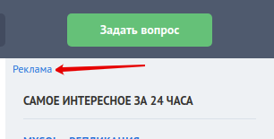
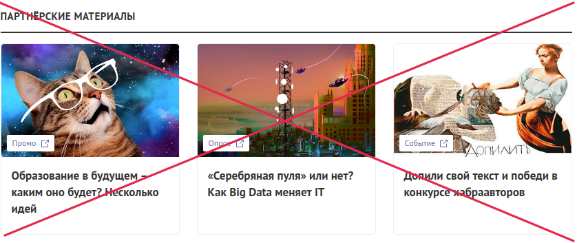

## Описание настроек вкладки "Скрыть лишнее"

**Скрывать блок рекомендаций**

Опция скрывает на всех страницах блок "Рекомендуем". AdBlock с ним по-умолчанию не справляется.

---

**Скрывать блок с вакансиями и заказами**

Опция скрывает на всех страницах блок с вакансиями и заказами.

---

**Скрыть верхнюю панель со ссылками**

Опция скрывает ненужную верхнюю панель со ссылками на сервисы ТМ.

---

**Скрыть рекламный блок из правой панели**

Опция скрывает рекламный блок из правой панели. В DOM присутствует контейнер для баннера. Он тоже скрывается.

---

**Скрыть блок "Партнёрские материалы"**

Опция скрывает блок "Партнёрские материалы" с всех страниц.

