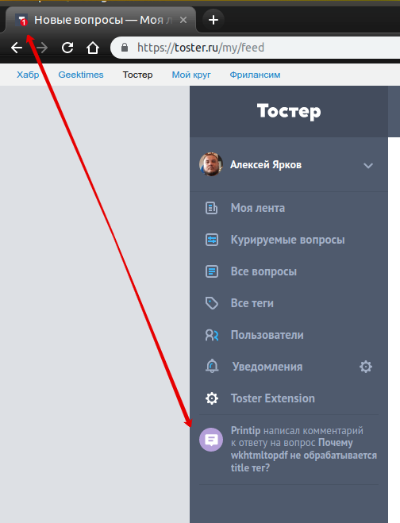

## Описание настроек вкладки "Уведомления"

**Включить реалтайм показ новых уведомлений**

Опция позволяет проверять наличие непрочитанных уведомлений в фоне, без перезагрузки страницы.

Проверка осуществляется периодическими AJAX запросами, поэтому не рекомендуется выставлять слишком маленький интервал. Интервал указывается в миллисекундах (1000 = 1 секунда).

Данная опция активирует все остальные, так что включение опций ниже не имеет смысла без нее.

---

**Включить звуковое уведомление**

Опция включает оповещение звуком (7 мелодий на выбор) о непрочитанных уведомлениях, но только если нет активной вкладки с Тостером, чтобы не создавать лишней нагрузки на пользователя.

---

**Показывать всплывающие уведомления**

Опция показывает всплывающее системное сообщение о непрочитанных уведомлениях, но только если нет активной вкладки с Тостером, чтобы не создавать лишней нагрузки на пользователя.

---

**Показывать количество уведомлений на иконке расширения**

Опция показывает количество непрочитанных уведомлений на иконке расширения.

---

**Показывать количество уведомлений на иконке сайта (favicon)**

Опция показывает количество уведомлений на иконке сайта (favicon).

