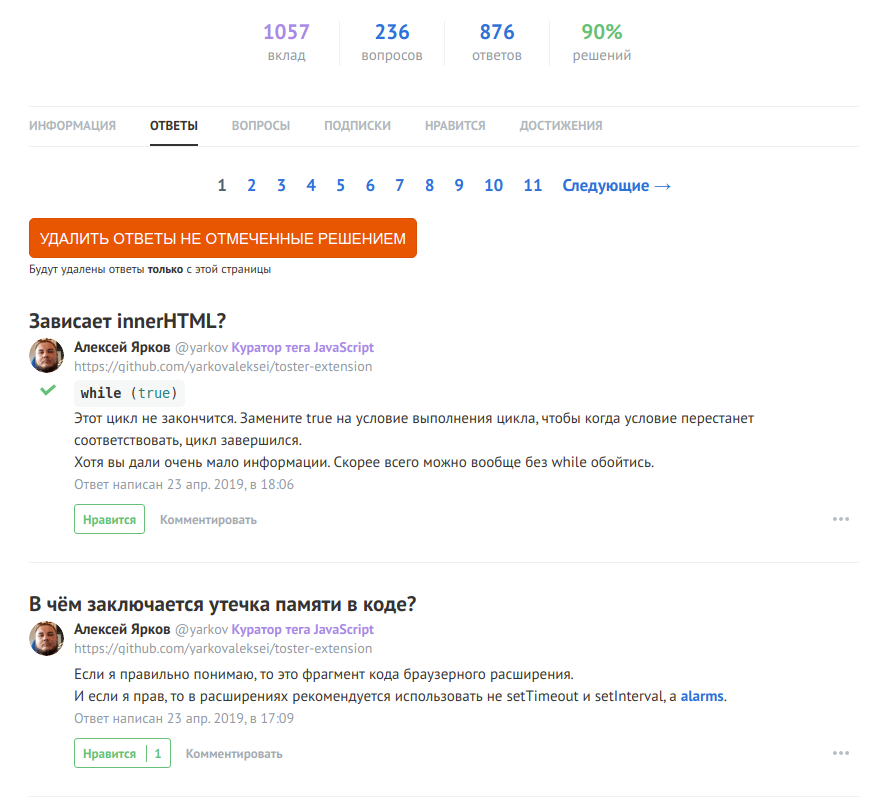

## Описание настроек вкладки "Разное"

**Событие клика по иконке расширения**

Опция переключает действие, которое произойдет если кликнуть на иконку расширения.

Сейчас доступно 2 варианта:

- Открыть сайт Тостер
- Открыть настройки расширения
  ***

**Показывать кнопку удаления ответов, не отмеченных решением**

Опция показывает кнопку на странице списка ответов пользователя, клик на которую удалит ответы, которые не были отмечены решением.

Некоторые пользователи хотят по разным причинам поднять показатель процента решений в профиле. А что для этого надо? Верно! Надо чтобы количество ответов максимально совпадало с количеством ответов, которые выбрали решением. Но к сожалению не все нажимают эту кнопку и пользователю чтобы удалить свои ответы приходится совершать лишние движения мышкой.

С этой опцией подтасовка будет куда проще :smile:

Кстати кнопка отображается только в том случае, если на странице есть неотмеченные ответы.

---

**Выводить даты в формате 23 апр. 2019, в 15:17**

Опция выводит дату публикации ответа/комменатрия в удобном человеку формате.

---

**Добавить в меню ссылку на страницу настроек**

Опция в меню сайта ссылку на страницу настроек расширения.

Например можно настроить клик по иконке расширения так, чтобы открывался qna.habr.com, а в настройки попадать по этой ссылке.

---

**Растянуть сайт на 100% в ширину**

Опция позволяет растянуть сайт на 100% в ширину. По-умолчанию максимальная ширина составляет 1440px. На мониторах, которые шире этого значения, появляются полосы по бокам. Данная опция их убирает.
