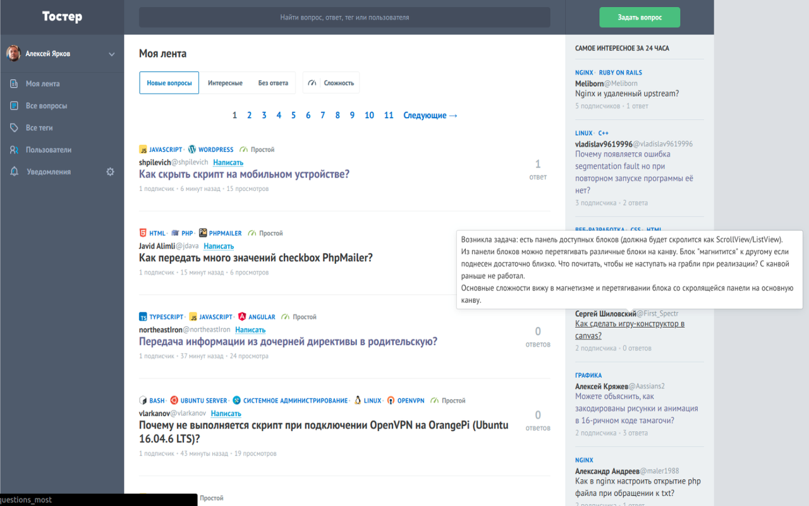
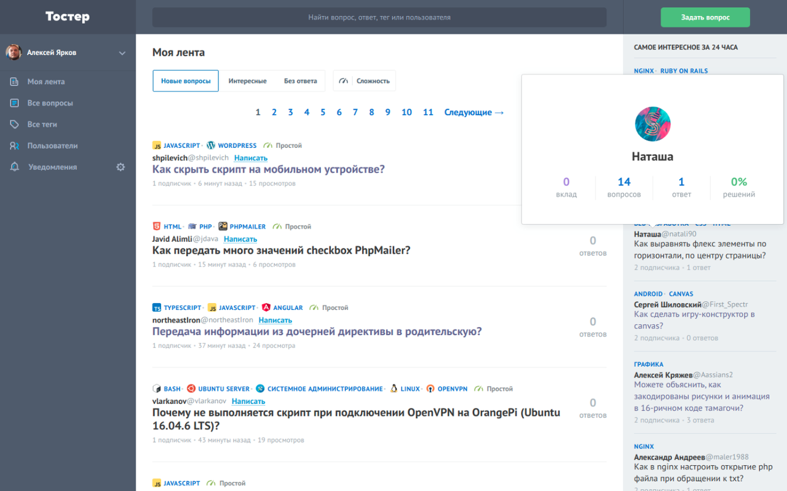

## Описание настроек вкладки "Превью"

**Показывать превью вопроса при наведении на заголовок**

Опция позволяет посмотреть текст вопроса не переходя по ссылке, а просто наведя курсор на заголовок вопроса в ленте, либо в списке "Самое интересное за 24 часа".

Дополнительно можно указать в настройках количество миллисекунд, которое должно пройти с момента наведения курсора до загрузки превью. Это сделано, чтобы не было ложных срабатываний при перемещении мыши по странице. Задержка указывается в миллисекундах (1000 = 1 секунда).

---

**Показывать превью профиля пользователя при наведении на имя**

Опция позволяет посмотреть профиль пользователя не переходя по ссылке, а просто наведя курсор на имя или ник пользователя в ленте, либо в списке "Самое интересное за 24 часа".

Дополнительно можно указать в настройках количество миллисекунд, которое должно пройти с момента наведения курсора до загрузки превью. Это сделано, чтобы не было ложных срабатываний при перемещении мыши по странице. Задержка указывается в миллисекундах (1000 = 1 секунда).

---

**Вырезать примеры кода из превью вопроса**

Зачастую в вопросах встречаются большие фрагменты кода и при загрузке превью вопроса будет очень неудобно его смотреть. Для это предусмотрена опция замены фрагментов кода на конструкцию <pre>[CODE]</pre>

Так вы будете знать, что в вопросе есть фрагмент кода и надо перейти на страницу вопроса, чтобы увидеть его, но в то же время превью не будет огромным.
