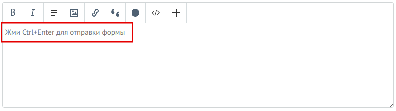
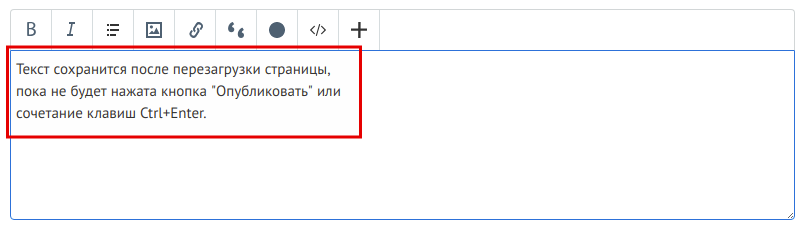
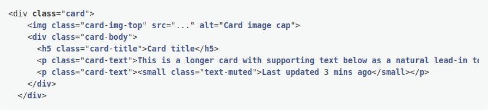
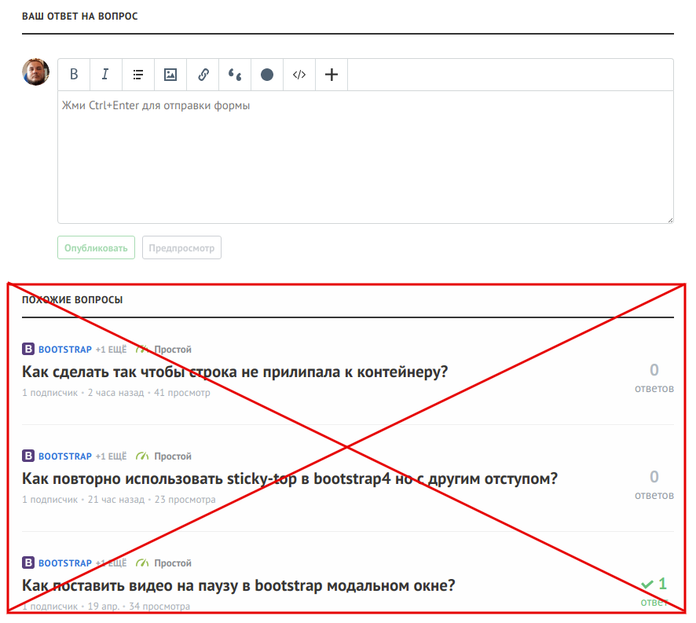
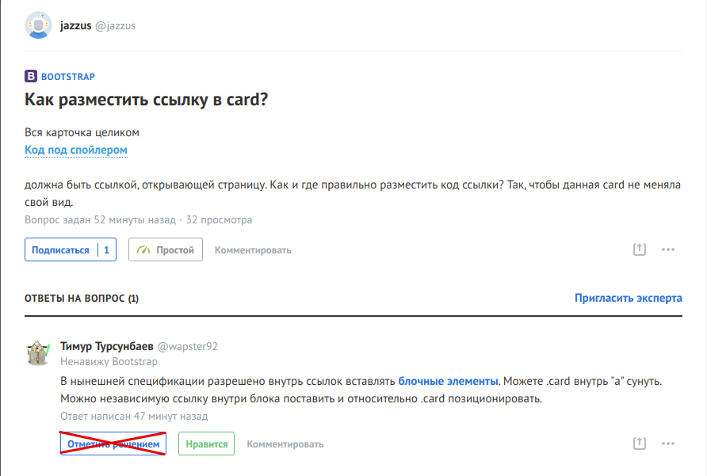
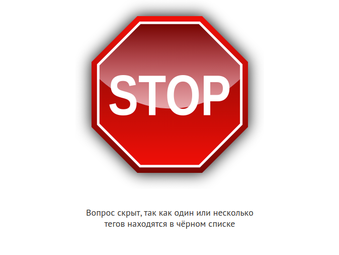

## Описание настроек вкладки "Страница вопроса"

**Использовать <kbd>Ctrl+Enter</kbd> для отправки формы**

Опция позволяет отправлять введенный текст нажатием сочетания клавиш <kbd>Ctrl+Enter</kbd>, чтобы не тянуться за мышью. Для понимания, что опция включена, в каждое поле добавлен плэйсхолдер.

Сочетание клавиш работает в комментариях к вопросу, в комментариях к ответу и в форме ответа на вопрос.

---

**Сохранять введенный в форму ответа/комментария текст до отправки**

Опция позволяет сохранять введенный текст в любом поле на странице вопроса до отправки формы.

Например Вы писали длинный ответ и случайно перезагрузили страницу. Раньше текст был бы потерян, но с включенной опцией он будет сохранен, пока Вы его не отправите.

Сохранение работает в комментариях к вопросу, в комментариях к ответу и в форме ответа на вопрос.

---

**Оборачивать примеры кода в спойлер**

Опция позволяет оборачивать примеры кода в спойлер автоматически.

Такм образом длинные фрагменты кода будут автоматически свернуты при открытии страницы, что существенно облегчает восприятие информации и навигацию по странице.

---

**Включать моноширинный шрифт для кода в вопросах/ответах/комментариях**

Опция включает моноширинный шрифт для кода.

Например я привык работать с шрифтом Fira Code и мне привычно видеть исходный код именно таким шрифтом.

Опция работает в комментариях к вопросу, в комментариях к ответу и в ответах на вопрос.

Обычный код: 

С включенной опцией: 

---

**Открывать ссылки со страницы вопроса в новой вкладке**

На странице вопроса всем ссылкам добавляется атрибут `target="_blank"`.

Таким образом когда мы переходим по ссылке из вопроса или ответа, то она всегда открывается в новой вкладке.

---

**Скрывать блок "Похожие вопросы"**

Опция скрывает на странице вопроса блок "Похожие вопросы".

---

**Скрывать кнопку "Отметить решением" (для чужих вопросов)**

Опция скрывает на странице вопроса кнопки "Отметить решением" (для чужих вопросов).

---

**Поменять местами кнопки "Отметить решением" и "Нравится"**

Опция меняет местами на странице вопроса кнопки "Отметить решением" и "Нравится".

---

**Отображать заглушку, если вопрос скрыт с помощью чёрного списка**

Опция показывает заглушку на странице вопроса, если автор либо один и более тегов в чёрном списке. Такие вопросы скрываются из списков, но могут быть открыты по прямой ссылке.

