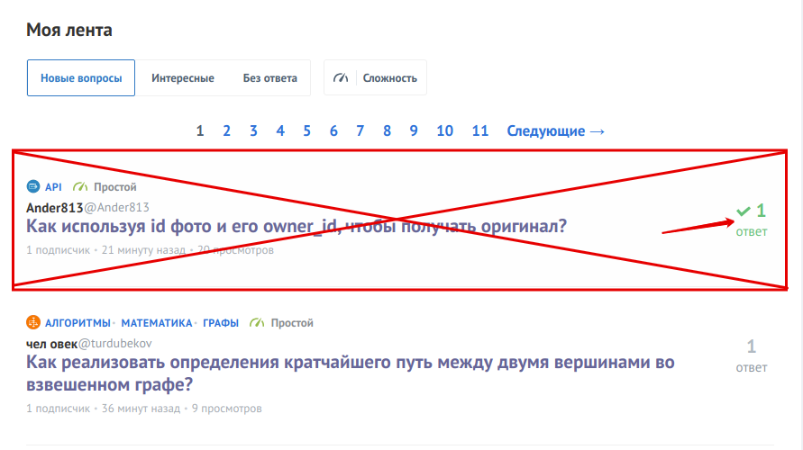
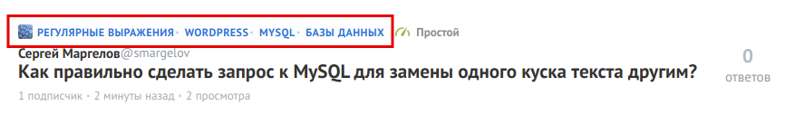

## Описание настроек вкладки "Список вопросов"

**Дублировать пагинацию над списком вопросов**

Опция дублирует навигацию по страницам над списком вопросов.

---

**Скрывать вопросы с решениями**

Опция скрывает из списка вопросы, у которых уже найдено решение.

---

**Показывать имя автора**

Опция включает отображение имени автора в списке вопросов.

---

**Показывать ник автора**

Опция включает отображение никнейма автора в списке вопросов.

---

**Показывать теги**

Опция включает отображение всех тегов в списке вопросов.

---

**Показывать изображения тегов**

Опция включает отображение картинок для тегов в списке вопросов.

---
