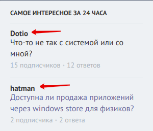
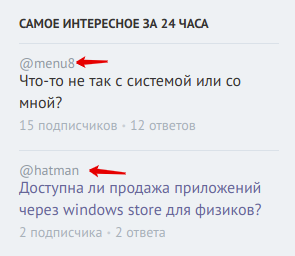
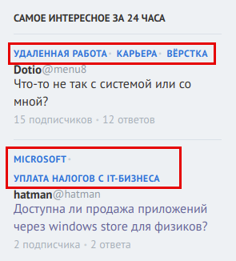

## Описание настроек вкладки "Список вопросов ТОП 24"

**Скрывать блок "Самое интересное за 24 часа"**

Опция скрывает блок "Самое интересное за 24 часа" со страницы полностью и растягивает основную часть вправо.

---

**Показывать имя автора**

Опция включает отображение имени автора в списке вопросов.

---

**Показывать ник автора**

Опция включает отображение никнейма автора в списке вопросов.

---

**Показывать теги**

Опция включает отображение всех тегов в списке вопросов.

