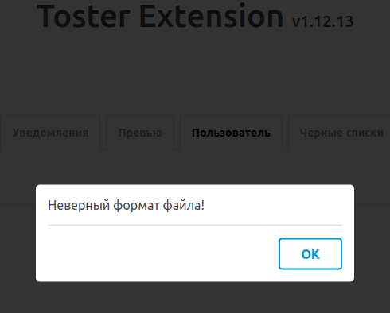
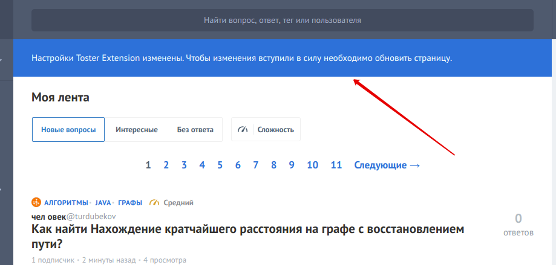



## Специальные возможности

**Поиск по Тостеру из адресной строки**

Введите в адресную строку слово `toster` и нажмите пробел.

Теперь введите поисковый запрос, нажмите <kbd>Enter</kbd> и получите результат поиска по Тостеру в текущей вкладке.

---

**Бэкап и восстановление настроек**

Возможность сохранения и восстановления настроек может пригодиться при переустановке расширения, либо чтобы на другом компьютере воспроизвести настройки в точности как на первом.

Настройки сохраняются в файл с именем `toster-extension.json` и могут быть отредактированы в любом текстовом редакторе.

Если при восстановлении расширение поймет, что ему подсовывают невалидный файл (например отсутствуют какие-то опции или наоборот есть лишние), то будет показано предупреждение и восстановление будет отменено.

---

**Флеш уведомления**

Расширение умеет показывать флеш уведомления.

Например после изменении настроек, на всех вкладках, где открыт Тостер, будет показано уведомление.

